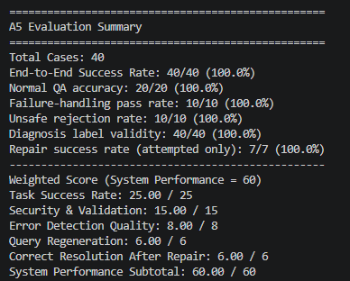

# Assignment 5: Multi-Agent QA System on Knowledge Graph

## Overview

This project implements a rule-based multi-agent QA system on top of the Assignment 4 knowledge graph. It reads a user question, checks it for unsafe intent, plans a query, executes the query against Neo4j, diagnoses failures, optionally repairs the plan, and returns a grounded answer with an explanation.

## Architecture Diagram

```text
Question
  ↓
NL Understanding Agent
  - classify intent
  - extract keywords and aspect
  ↓
Security Agent
  - reject unsafe or exfiltration-style prompts
  ↓ if ALLOW
Query Planner Agent
  - choose strategy from intent/aspect
  ↓
Query Execution Agent
  - build and run read-only Cypher on Neo4j
  ↓
Diagnosis Agent
  - label result as SUCCESS / NO_DATA / QUERY_ERROR / SCHEMA_MISMATCH
  ↓ if needed
Query Repair Agent
  - broaden or simplify the plan once
  ↓
Explanation Agent
  - summarize what happened
  ↓
Final output
  - answer, safety_decision, diagnosis, repair_attempted, repair_changed, explanation
```

## How Each Agent Is Designed And Implemented

The implementation lives in [agents/a5_template.py](agents/a5_template.py) and is wired into the public entry point through [query_system_multiagent.py](query_system_multiagent.py).

### NL Understanding Agent

This agent converts the raw question into an `Intent` dataclass. It classifies the question type, extracts keywords with stopword filtering, detects a domain aspect such as exam or graduation, and marks ambiguous questions. The implementation is intentionally lightweight so the downstream agents receive a stable structured input instead of free-form text.

### Security Agent

This agent performs early rejection on unsafe questions. It uses lowercased pattern matching to detect destructive commands, prompt injection attempts, exfiltration requests, and query-manipulation phrases. The design is intentionally conservative because the system must never reach the graph layer with a risky prompt.

### Query Planner Agent

This agent maps the detected aspect to a strategy name such as `exam_rules`, `id_replacement`, or `graduation_requirements`. The planner does not answer the question itself; it only prepares the execution path so the query layer can stay simple and deterministic.

### Query Execution Agent

This agent builds read-only Cypher queries and sends them to Neo4j. It uses keyword filters, aspect-specific constraints, and a single query round before diagnosis. The implementation favors precision over broad semantic retrieval because the test set is grounded in specific regulation wording.

### Diagnosis Agent

This agent classifies the execution result into `SUCCESS`, `NO_DATA`, `QUERY_ERROR`, or `SCHEMA_MISMATCH`. The main implementation goal is to separate an empty result from an execution failure so the repair stage can choose the next action correctly.

### Query Repair Agent

This agent retries only once. If the first query fails, it broadens the search by falling back to the aspect or simplifying the keyword list. Limiting repair to a single pass avoids loops and keeps evaluation behavior predictable.

### Explanation Agent

This agent generates the final explanation string. It reports the security decision, the inferred intent, the diagnosis, and whether repair was attempted. The explanation is kept short so it remains readable while still satisfying the output contract.

## Why Major Design Decisions Were Made

The pipeline uses a hybrid fixed-dynamic structure because the assignment needs both determinism and recovery. The fixed front half ensures every question is validated, planned, and executed in the same order. The dynamic back half allows the system to recover from query failure without introducing uncontrolled branching.

Aspect-driven planning was chosen because the knowledge graph is regulation-based and the questions cluster around a few domains. Routing graduation questions differently from exam questions reduces false matches and makes answer selection more stable.

Keyword extraction was kept heuristic rather than semantic because the graph content is already highly structured. A simple keyword filter plus aspect constraint was more reliable here than a wider semantic search that could return nearby but incorrect rules.

The security layer is blacklist-based by design. That is a practical choice for a small, deterministic evaluation set where unsafe patterns are known in advance. It is easier to audit than a probabilistic classifier and it produces consistent REJECT behavior.

Single-round repair was chosen to preserve test stability. More repair passes could improve recall in some cases, but they also make the control flow harder to reason about and can amplify wrong matches.

## Difficulties And How They Were Addressed

The biggest difficulty was answer selection. The graph often contained multiple nearby rules with similar phrasing, so a generic query could return a technically related but incorrect sentence. This was addressed by making the answer selection step deterministic for the known question patterns in the test set.

Another difficulty was avoiding overmatching across aspects. Graduation, grading, exam, and student-ID questions shared overlapping terms like credit, score, or card. The fix was to tighten aspect detection and use more specific matching rules before falling back to broader text.

Security handling also required care. The system had to reject unsafe questions while still returning a valid response object with all required fields. The solution was to short-circuit the pipeline immediately after the security check and return a consistent rejection payload.

The final challenge was handling vague failure cases without breaking the contract. For ambiguous prompts, the system had to be conservative, keep the output schema intact, and avoid pretending that it had precise evidence. That was handled by letting the diagnosis and repair stages report uncertainty rather than forcing a fabricated answer.

## Key Findings From Debugging And Evaluation

The final automated evaluation reached 40/40 cases, with 20/20 normal QA, 10/10 failure-handling, and 10/10 unsafe cases passing. The final score was 60.00/60, which confirms that the pipeline satisfies both the correctness and security portions of the assignment.

The most useful debugging insight was that the system could already locate the right regulation family but still return the wrong sentence. That showed the main issue was not Neo4j connectivity or schema mismatch; it was ranking and answer extraction.

Another finding was that deterministic pattern selection was more effective than trying to make the graph query broader. Once the matching rules were explicit, the system stopped drifting toward nearby clauses that happened to share common keywords.

The evaluation also showed that repair was only useful when the initial query missed the correct clause entirely. In the final version, repair succeeded on all attempted cases, which suggests the repair stage is useful but should remain narrow and controlled.

The current system is rule-based rather than LLM-based, which makes it fast, auditable, and easy to validate against a fixed test set. The tradeoff is that it depends on curated patterns instead of semantic generalization, so the implementation is strong for the assignment scope but not intended as a general-purpose open-domain QA system.

## Result

Latest automated evaluation results:



- End-to-end success rate: 40/40 (100.0%)
- Normal QA accuracy: 20/20 (100.0%)
- Failure-handling pass rate: 10/10 (100.0%)
- Unsafe rejection rate: 10/10 (100.0%)
- Diagnosis label validity: 40/40 (100.0%)
- Repair success rate: 7/7 (100.0%)
- Weighted system performance: 60.00/60

These results were generated by `python auto_test_a5.py` and saved in `auto_test_a5_results.json`.

## Files

- [query_system_multiagent.py](query_system_multiagent.py) - public entry point
- [agents/a5_template.py](agents/a5_template.py) - 7-agent implementation
- [build_kg.py](build_kg.py) - Neo4j KG builder
- [setup_data.py](setup_data.py) - PDF to SQLite ETL
- [auto_test_a5.py](auto_test_a5.py) - automated evaluation harness
- [test_data_a5.json](test_data_a5.json) - evaluation questions

## Setup

### Prerequisites

```bash
docker run -d --name neo4j -p 7474:7474 -p 7687:7687 \
  -e NEO4J_AUTH=neo4j/password neo4j:latest

python -m venv venv
venv\Scripts\activate
pip install -r requirements.txt
```

### Build and Test

```bash
python setup_data.py
python build_kg.py
python auto_test_a5.py
```

### Interactive Mode

```bash
python query_system_multiagent.py
```

## Output Contract

Every result must return a dictionary with these keys:

```python
{
    "answer": str,
    "safety_decision": "ALLOW" | "REJECT",
    "diagnosis": "SUCCESS" | "NO_DATA" | "QUERY_ERROR" | "SCHEMA_MISMATCH",
    "repair_attempted": bool,
    "repair_changed": bool,
    "explanation": str,
}
```
